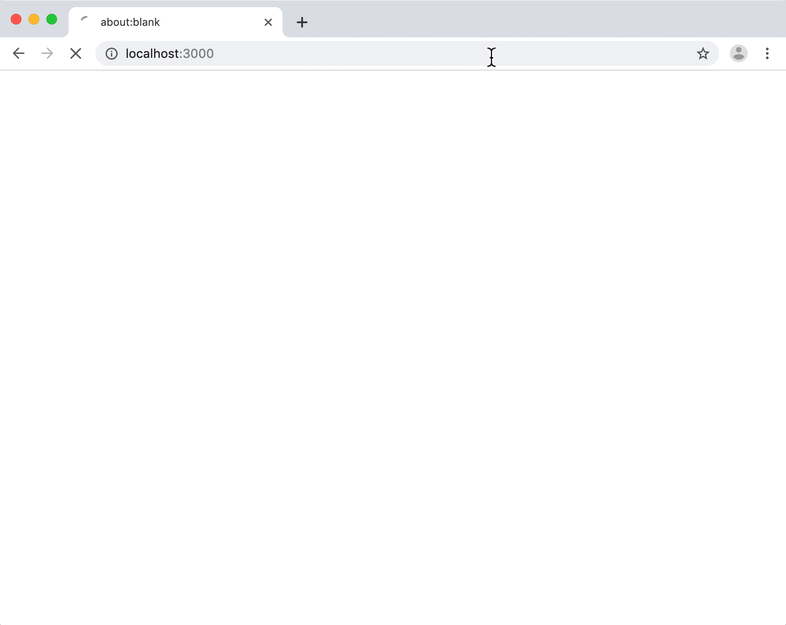

# node-fetch-har

## Update

This is a fork of [node-fetch-har](https://www.npmjs.com/package/node-fetch-har).
The changes include:

1. Adding basic typescript support. 
   - More work needs to be done to remove 'any' usage for some prototype override hacks.
2. Removing all fetch libaries support besides node-fetch.
3. Updating all dependencies and supporting latest node releases.
4. Adding dependency on typescript-specific hars package: [@hars-sdk/core](https://www.npmjs.com/package/@har-sdk/core).

## Description

A [Fetch API][fetch] wrapper that records [HAR logs][har] for server requests
made with [node-fetch][]. You can then expose this data to get visibility into
what’s happening on the server.

**See also the companion project for Next.js integration, [next-fetch-har](https://github.com/exogen/next-fetch-har).**



## Status

**STABLE**

Due to the wide variety seen in HTTP requests, please test thoroughly with your
application and [file an issue](https://github.com/exogen/node-fetch-har/issues)
if you find any problems.

## Warning

⚠️ **HAR files can contain sensitive information like cookies or passwords.**
Since this library is for capturing what happens on the server, this is
especially important because it is information that users can’t normally acces
in their own browser. Be careful about sharing this data. If you provide a way
to expose it, ensure it is only enabled for superusers or in secure
environments.

## Usage

The `withHar` function takes a base Fetch implementation such as `node-fetch`
and returns a new one that records HAR entries:

```js
import { withHar } from 'node-fetch-har';
import nodeFetch from 'node-fetch';

const fetch = withHar(nodeFetch);
```

Individual HAR entries can then accessed on the `response` object:

```js
fetch('https://httpstat.us/200').then((response) => {
    console.log(response.harEntry);
    return response;
});
```

Or by configuring `withHar` with an `onHarEntry` callback:

```js
const fetch = withHar(nodeFetch, {
    onHarEntry: (entry) => console.log(entry),
});
```

You can also customize `onHarEntry` for individual requests:

```js
const fetch = withHar(nodeFetch);

fetch('https://httpstat.us/200', {
    onHarEntry: (entry) => console.log(entry),
});
```

To disable HAR tracking for individual requests, set the `har` option to `false`:

```js
fetch('https://httpstat.us/200', { har: false }).then((response) => {
    console.log(response.harEntry); // Should be undefined.
    return response;
});
```

The above options will give you individual HAR entries. It’s likely that you’ll
want to collect multiple requests into a single HAR log. For example, all API
calls made while rendering a single page. Use the `createHarLog` function to
generate a complete HAR object that can hold multiple entries.

You can pass the resulting object via the `har` option and entries will
automatically be added to it:

```js
import { withHar, createHarLog } from 'node-fetch-har';
import nodeFetch from 'node-fetch';

async function run() {
    const har = createHarLog();
    const fetch = withHar(nodeFetch, { har });

    await Promise.all([
        fetch('https://httpstat.us/200'),
        fetch('https://httpstat.us/200'),
        fetch('https://httpstat.us/200'),
    ]);

    console.log(har);
}
```

You can also call `createHarLog` with an array of entries, if you’ve already
collected them in a different way:

```js
const har = createHarLog(entries);
```

### Redirects

Due to redirects, it is possible for a single `fetch` call to result in multiple
HTTP requests. As you might expect, multiple HAR entries will be recorded as
well.

With the Fetch API’s `redirect` option in `follow` mode (the default), calls
will transparently follow redirects; that is, you get the response for the
final, redirected request. Likewise, the `harEntry` property of the response
will correspond with that final request.

To get the HAR entries for the redirects, use the `har` or `onHarEntry` options
(described above). The redirects will be appended to the log and reported with
`onHarEntry` in addition to the final entry, in the order that they were made.

### Request Body

If there is no `Content-Type` header specified in the request, then `postData`
will not be populated since we would not be able to populate the required
`mimeType` field.

Additionally, `params` will only be populated if the `Content-Type` is exactly
`application/x-www-form-urlencoded`. If it is anything else (including
`multipart/form-data`) then `text` will be populated instead.

There may be limited support for exotic request body encodings.

### Custom Agent

This library works by using the custom `agent` option supported by `node-fetch`.
However, it should still work if you pass your own custom `agent` as well. The
provided agent instance will have its `addRequest` method instrumented with the
necessary HAR tracking behavior. This behavior will be skipped if the request
does not originate from a Fetch instance returned by `withHar`.

### Page Info

The second argument to `createHarLog` allows you to add some initial page info:

```js
const har = createHarLog([], { title: 'My Page' });
```

If you have additional pages within a single log, you’ll have to add them
yourself:

```js
har.log.pages.push({ title: '2nd Page' });
```

If not provided, a default page will be created with an ID of `page_1`. By
default, all HAR entries will reference this page. To customize the page that
entries reference, use the `harPageRef` option to `withHar`:

```js
const fetch = withHar(nodeFetch, { har, harPageRef: 'page_2' });
```

Or use the `harPageRef` option to `fetch` for individual requests:

```js
await fetch(url, { harPageRef: 'page_2' });
```

## Examples

See the [demo](./demo/pages/index.js) for an example of exposing an SSR HAR
log from Next.js.

Run the demo like so:

```console
$ cd demo
$ yarn
$ yarn start
```

## TODO

-   More tests for different response types, protocols (HTTP/2), encodings, etc.

## How does it work?

`node-fetch` supports a custom `agent` option. This can be used to capture very
detailed information about the request all the way down to the socket level if
desired. This library only uses it in a very simplistic way, to capture a few
key timestamps and metadata like the HTTP version.

[fetch]: https://developer.mozilla.org/en-US/docs/Web/API/Fetch_API
[node-fetch]: https://github.com/bitinn/node-fetch
[har]: http://www.softwareishard.com/blog/har-12-spec/
[npm]: https://www.npmjs.com/package/node-fetch-har
